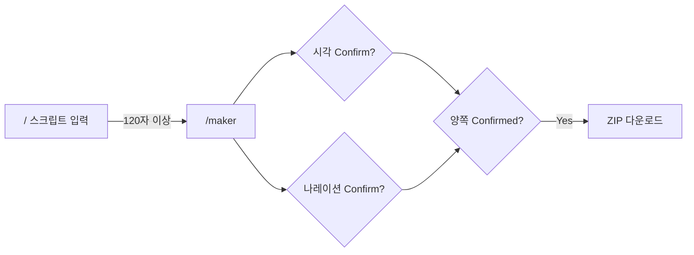

# AI 숏폼 메이커 — 프로젝트 기획서 & 개발 스펙

> **최종 갱신:** 2026-03-17
> **버전:** 0.1.0 (MVP)
> **프로젝트명:** AI 숏폼 메이커 (ai-video-maker)

---

## 목차

1. [프로젝트 개요](#1-프로젝트-개요)
2. [핵심 기능 요약](#2-핵심-기능-요약)
3. [기술 스택](#3-기술-스택)
4. [프로젝트 구조](#4-프로젝트-구조)
5. [라우팅 & 페이지 설계](#5-라우팅--페이지-설계)
6. [데이터 모델 (DB 구조)](#6-데이터-모델-db-구조)
7. [상태 관리 아키텍처](#7-상태-관리-아키텍처)
8. [API 엔드포인트 명세](#8-api-엔드포인트-명세)
9. [AI 서비스 연동 상세](#9-ai-서비스-연동-상세)
10. [컴포넌트 계층 구조](#10-컴포넌트-계층-구조)
11. [사용자 플로우](#11-사용자-플로우)
12. [환경 변수](#12-환경-변수)
13. [완료 기준 (Acceptance Criteria)](#13-완료-기준-acceptance-criteria)

---

## 1. 프로젝트 개요

### 1.1 비전

사용자가 **스크립트(대본)를 입력하면**, AI가 자동으로 장면을 분할하고, 각 장면의 이미지와 영상 클립을 생성하며, 나레이션까지 만들어 **숏폼 영상 제작에 필요한 모든 소재를 한 번에 생산**하는 올인원 AI 영상 메이커.

### 1.2 핵심 컨셉

| 항목 | 설명 |
|------|------|
| **타겟 사용자** | 숏폼 영상 크리에이터, 마케터, 1인 미디어 제작자 |
| **핵심 가치** | 스크립트 하나로 영상 소재(이미지+클립+나레이션) 일괄 생성 |
| **차별점** | 시각(Visual) + 청각(Audio) 병렬 파이프라인으로 동시 진행 |
| **최종 산출물** | 장면별 이미지, 영상 클립, 나레이션 오디오를 포함한 ZIP 패키지 |

### 1.3 핵심 흐름

```
"/" 스크립트 입력 → "/maker" 이동 → 시각/청각 병렬 진행 → 양쪽 Confirm → ZIP 다운로드
```

---

## 2. 핵심 기능 요약

### 2.1 시각 파이프라인 (Visual Pipeline)

| 단계 | 기능 | 설명 |
|------|------|------|
| **Step 0** | 장면 분할 (Scene Split) | GPT가 스크립트를 의미 단위로 N개 장면 분해, 각 장면에 영어 프롬프트·한글 요약·구조화된 이미지/클립 프롬프트 JSON 자동 생성 |
| **Step 1** | 이미지 생성 (Image Gen) | 장면별 프롬프트로 Gemini 또는 GPT 이미지 생성, 레퍼런스 이미지 지원, 재생성·히스토리·개별 확정 |
| **Step 2** | 클립 생성 (Clip Gen) | 확정된 이미지를 Kling 또는 Seedance로 영상 클립 변환, 비동기 태스크 기반 처리, 모션 프롬프트 커스터마이징 |

### 2.2 청각 파이프라인 (Audio Pipeline)

| 기능 | 설명 |
|------|------|
| **나레이션 생성** | 스크립트 기반 TTS 나레이션 자동 생성 |
| **파라미터 조절** | 템포(25-200%), 톤, 목소리(남/여/아동), 스타일 |
| **미리듣기** | 오디오 플레이어(재생/일시정지/시크) |
| **다운로드** | MP3/WAV 포맷 선택 다운로드 |

### 2.3 공통 기능

- **설정 모달(ConfigModal):** 글로벌 스타일, AI 엔진 선택, 화면비, 해상도, 커스텀 룰
- **레퍼런스 이미지:** 캐릭터 일관성을 위한 다중 참조 이미지 업로드
- **스크립트 편집:** 제작 중 스크립트 수정 (하위 단계 초기화 경고)
- **ZIP 다운로드:** 시각+청각 양쪽 모두 Confirm 완료 시 활성화

---

## 3. 기술 스택

### 3.1 프레임워크 & 런타임

| 기술 | 버전 | 용도 |
|------|------|------|
| **Next.js** | 15.5.2 | App Router 기반 풀스택 프레임워크 |
| **React** | 19.1.0 | UI 라이브러리 |
| **TypeScript** | 5.x | 타입 안전성 |
| **Node.js** | - | 서버사이드 API 처리 |
| **Turbopack** | - | 번들러 (dev/build) |

### 3.2 UI & 스타일링

| 기술 | 용도 |
|------|------|
| **shadcn/ui** | 헤드리스 UI 컴포넌트 (Radix UI + Tailwind) |
| **Tailwind CSS** | 4.x — 유틸리티 퍼스트 CSS |
| **Lucide React** | 아이콘 라이브러리 |
| **CVA (Class Variance Authority)** | 컴포넌트 변형 관리 |
| **clsx + tailwind-merge** | 동적 클래스 병합 |
| **tw-animate-css** | 애니메이션 플러그인 |

### 3.3 상태 관리

| 기술 | 용도 |
|------|------|
| **Zustand** | 5.0.8 — 글로벌 AI 설정 상태 (localStorage 영속화) |
| **React useState/useRef** | 페이지 단위 로컬 상태 (장면, 이미지, 클립 등) |
| **localStorage** | 스크립트, AI 설정 영속 저장 |

### 3.4 AI/ML 서비스 SDK

| 서비스 | SDK/패키지 | 용도 |
|--------|-----------|------|
| **OpenAI** | openai 5.16.0 | 스크립트 분석, GPT 이미지 생성 |
| **Google Gemini** | @google/generative-ai 0.24.1 | Gemini 이미지 생성 |
| **Kling AI** | REST API (JWT 인증) | Image-to-Video 변환 |
| **Seedance (BytePlus)** | REST API | Image-to-Video 변환 (대체 엔진) |

### 3.5 유틸리티

| 패키지 | 용도 |
|--------|------|
| **jsonwebtoken** | Kling API JWT 서명 (30분 만료) |
| **jszip** | 최종 ZIP 파일 생성/압축 |
| **sharp** | 서버사이드 이미지 프로세싱 |
| **react-textarea-autosize** | 자동 높이 조절 텍스트 영역 |

### 3.6 개발 도구

| 도구 | 용도 |
|------|------|
| **pnpm** | 10.13.1 — 패키지 매니저 |
| **ESLint 9.x** | 코드 린팅 (flat config) |
| **Prettier** | 코드 포맷팅 |

---

## 4. 프로젝트 구조

```
ai-video-maker/
├── src/
│   ├── app/                          # Next.js App Router
│   │   ├── layout.tsx                # 루트 레이아웃
│   │   ├── page.tsx                  # "/" — 스크립트 입력 페이지
│   │   ├── globals.css               # 글로벌 스타일 (Tailwind CSS v4)
│   │   │
│   │   ├── maker/
│   │   │   └── page.tsx              # "/maker" — 메인 제작 페이지 (2섹션 레이아웃)
│   │   │
│   │   ├── video/
│   │   │   └── page.tsx              # "/video" — Kling 영상 생성 테스트 페이지
│   │   │
│   │   ├── gemini/
│   │   │   └── page.tsx              # "/gemini" — Gemini 이미지 생성 테스트 페이지
│   │   │
│   │   └── api/                      # 서버 API 라우트
│   │       ├── scenes/route.ts           # 스크립트 → 장면 분할 + 프롬프트 생성
│   │       ├── image-gen/
│   │       │   ├── gemini/[id]/route.ts  # Gemini 이미지 생성
│   │       │   └── gpt/[id]/route.ts     # GPT 이미지 생성
│   │       ├── kling/
│   │       │   ├── clip-gen/[id]/route.ts # Kling Image-to-Video
│   │       │   └── [id]/route.ts          # Kling 태스크 상태 조회
│   │       ├── seedance/
│   │       │   ├── clip-gen/[id]/route.ts # Seedance Image-to-Video
│   │       │   └── [id]/route.ts          # Seedance 태스크 상태 조회/취소
│   │       └── proxy/route.ts             # 프록시 엔드포인트
│   │
│   ├── components/
│   │   ├── maker/                    # 메이커 페이지 전용 컴포넌트
│   │   │   ├── HeaderBar.tsx             # 상태 배지 + ZIP 다운로드 버튼
│   │   │   ├── VisualPipeLine.tsx         # 3단계 시각 파이프라인 컨테이너
│   │   │   ├── NarrationPanel.tsx         # 청각 파이프라인 (나레이션 설정/재생)
│   │   │   ├── SceneRail.tsx             # 장면 네비게이션 레일
│   │   │   ├── SceneList.tsx             # 장면 목록 표시
│   │   │   ├── SceneCanvas.tsx           # 장면 상세 뷰
│   │   │   ├── ImageSection.tsx          # 이미지 생성 섹션
│   │   │   ├── ClipSection.tsx           # 클립 생성 섹션
│   │   │   ├── ConfigModal.tsx           # AI 설정 모달
│   │   │   ├── PromptEditor.tsx          # 장면 프롬프트 편집기
│   │   │   ├── ImagePromptEditor.tsx     # 이미지 프롬프트 JSON 편집기
│   │   │   ├── ClipPromptEditor.tsx      # 클립 프롬프트 JSON 편집기
│   │   │   ├── ScriptEditDialog.tsx      # 스크립트 수정 모달
│   │   │   └── ResetDialog.tsx           # 초기화 확인 모달
│   │   │
│   │   └── ui/                       # shadcn/ui 공통 컴포넌트
│   │       ├── button.tsx, card.tsx, dialog.tsx
│   │       ├── input.tsx, textarea.tsx, select.tsx
│   │       ├── slider.tsx, badge.tsx, separator.tsx
│   │       └── hover-card.tsx
│   │
│   ├── lib/
│   │   ├── maker/                    # 메이커 비즈니스 로직
│   │   │   ├── types.ts                  # 핵심 TypeScript 인터페이스
│   │   │   ├── useAiConfigStore.ts       # Zustand 설정 스토어
│   │   │   ├── prompt.ts                 # 장면 분할 프롬프트 템플릿
│   │   │   ├── imagePromptBuilder.ts     # 이미지 프롬프트 직렬화
│   │   │   ├── clipPromptBuilder.ts      # 클립 프롬프트 직렬화
│   │   │   └── utils.ts                  # 유틸리티 함수
│   │   └── shared/
│   │       └── utils.ts                  # 공유 유틸 (cn 함수 등)
│   │
│   └── components/temp/              # 임시/테스트용 컴포넌트
│       ├── tempJson.ts
│       ├── GenerateVideoWithUpload.tsx
│       └── ImageToBase64.tsx
│
├── public/                           # 정적 파일
├── docs/                             # 문서
│   └── prettier.md
│
├── package.json                      # 의존성 & 스크립트
├── tsconfig.json                     # TypeScript 설정
├── next.config.ts                    # Next.js 설정
├── components.json                   # shadcn/ui 설정
├── .env.local                        # 환경 변수 (비공개)
├── .prettierrc                       # Prettier 설정
└── .gitignore
```

---

## 5. 라우팅 & 페이지 설계

### 5.1 `"/"` — 스크립트 입력 페이지

**목적:** 영상 제작의 출발점. 사용자로부터 스크립트(대본)를 수집.

| 요소 | 상세 |
|------|------|
| **헤더** | "AI 숏폼 메이커" 타이틀 |
| **본문** | 자동 높이 Textarea, 글자·단어·문장 실시간 카운터 |
| **검증** | 최소 120자 이상 입력 필수 (Badge로 상태 표시) |
| **액션** | "메이커로 이동" 버튼 → `/maker`로 라우팅 |
| **상태 저장** | `localStorage('ai-shortform-script')`에 자동 저장 |

### 5.2 `"/maker"` — 메인 제작 페이지

**목적:** 시각+청각 파이프라인을 하나의 화면에서 병렬 진행.

```
┌──────────────────────────────────────────────────────────────────┐
│ HeaderBar: 프로젝트 상태 배지(씬/이미지/클립/나레이션) │ ZIP 다운로드 │
├──────────────────────────────────────────────────────────────────┤
│                                                                  │
│  [좌측] 시각 파이프라인              │  [우측] 청각 파이프라인    │
│  ┌─────────────────────────────┐    │  ┌──────────────────────┐  │
│  │ Step 0: 장면 분할           │    │  │ 나레이션 설정         │  │
│  │ Step 1: 이미지 생성         │    │  │ - 템포 슬라이더       │  │
│  │ Step 2: 클립 생성           │    │  │ - 톤/목소리/스타일    │  │
│  │                             │    │  │ 오디오 플레이어       │  │
│  │ SceneRail (장면 네비게이션) │    │  │ 생성/재생성/확정 버튼 │  │
│  └─────────────────────────────┘    │  └──────────────────────┘  │
│                                                                  │
├──────────────────────────────────────────────────────────────────┤
│ Footer: 초기화 │ 되돌리기 │ 상태 토스트                          │
└──────────────────────────────────────────────────────────────────┘
```

**레이아웃:** `grid-cols-1 md:grid-cols-2` (모바일 1열, 데스크톱 2열)

### 5.3 테스트 페이지

| 경로 | 용도 |
|------|------|
| `/video` | Kling 영상 생성 API 테스트 |
| `/gemini` | Gemini 이미지 생성 API 테스트 |

---

## 6. 데이터 모델 (DB 구조)

> **현재 아키텍처:** 전통적 DB 없이 **React 상태 + localStorage** 기반으로 운영 (MVP 단계)

### 6.1 핵심 엔티티 관계도

```
┌─────────────┐     1:N     ┌──────────────┐     1:1     ┌────────────────┐
│   Script     │ ──────────▶│    Scene      │ ──────────▶│ GeneratedImage │
│   (string)   │            │              │            │                │
└─────────────┘            │  imagePrompt  │            └────────────────┘
                           │  clipPrompt   │                    │
                           └──────────────┘                    │ 1:1
                                                               ▼
                                                       ┌────────────────┐
                                                       │ GeneratedClip  │
                                                       └────────────────┘

┌─────────────┐     1:1     ┌───────────────────┐
│   Script     │ ──────────▶│ GeneratedNarration │
│   (string)   │            └───────────────────┘
└─────────────┘

┌───────────────┐    (글로벌 설정, 모든 장면에 적용)
│ AIConfigState  │
│  - globalStyle │
│  - ratio       │
│  - resolution  │
│  - imageAiType │
│  - clipAiType  │
│  - refImages[] │
└───────────────┘
```

### 6.2 Scene (장면)

스크립트에서 분할된 하나의 장면 단위.

```typescript
interface Scene {
  id: string;              // "scene-1", "scene-2", ...
  originalText: string;    // 스크립트 원문 (verbatim 발췌)
  englishPrompt: string;   // 이미지 생성용 영어 프롬프트
  sceneExplain: string;    // 한국어 의도/감정 설명 (1-2문장)
  koreanSummary: string;   // 한국어 시각/기술 요약
  imagePrompt: ImagePromptJson;  // 구조화된 이미지 프롬프트
  clipPrompt: ClipPromptJson;    // 구조화된 클립 프롬프트
  confirmed: boolean;      // 장면 확정 여부
}
```

**장면 집합 관리:**
```typescript
interface ScenesState {
  byId: Map<string, Scene>;  // ID → Scene 매핑 (O(1) 조회)
  order: string[];            // 장면 순서 배열
}
```

### 6.3 ImagePromptJson (이미지 프롬프트 구조체)

AI 이미지 생성에 사용되는 구조화된 프롬프트.

```typescript
interface ImagePromptJson {
  intent: string;         // 장면 목적 & 감정 (≤12단어)
  img_style: string;      // 비주얼 스타일 (예: "anime illustration")

  camera: {
    shot_type: string;    // "close-up" | "medium" | "long"
    angle: string;        // 카메라 앵글/틸트
    focal_length: string; // 렌즈 초점거리 (예: "50mm")
  };

  subject: {
    pose: string;         // 포즈 & 방향
    expression: string;   // 표정 (하나의 명확한 감정)
    gaze: string;         // 시선 방향
    hands: string;        // 손 위치/제스처 & 들고 있는 물건
  };

  lighting: {
    key: string;          // 주조명 방향 & 강도
    mood: string;         // 색온도 + 분위기
  };

  background: {
    location: string;     // 배경 장소 (브랜드 없음)
    dof: string;          // "shallow" | "medium" | "deep"
    props: string;        // 필수 소품만
    time: string;         // "dawn" | "morning" | "noon" | "sunset" | "evening" | "night"
  };
}
```

### 6.4 ClipPromptJson (클립 프롬프트 구조체)

Image-to-Video 생성에 사용되는 모션 프롬프트.

```typescript
interface ClipPromptJson {
  intent: string;         // 클립 목표 & 느낌 (≤12단어)
  img_message: string;    // 스틸 이미지가 전달하는 메시지

  background: {
    location: string;     // 장소 (이미지와 동일하거나 연속)
    props: string;        // 이미지에 보이거나 논리적으로 일관된 소품
    time: string;         // 시간대
  };

  camera_motion: {
    type: string;         // "push-in" | "pan" | "tilt" | "handheld sway" | "none"
    easing: string;       // "linear" | "ease-in" | "ease-out" | "ease-in-out"
  };

  subject_motion: Array<{
    time: string;         // 타임라인 위치 (예: "0.5s", "1.2s")
    action: string;       // 미세 동작 (눈 깜빡임, 호흡, 머리카락 날림 등)
  }>;

  environment_motion: Array<{
    type: string;         // "lighting" | "atmosphere" | "background" | "particles" | "props"
    action: string;       // 미세한 환경 변화
  }>;
}
```

### 6.5 GeneratedImage (생성된 이미지)

```typescript
interface GeneratedImage {
  status: 'idle' | 'pending' | 'succeeded' | 'failed';
  sceneId: string;        // 연관 장면 ID
  dataUrl?: string;       // Base64 이미지 데이터
  timestamp: number;      // 생성 타임스탬프
  confirmed: boolean;     // 이미지 확정 여부
  error?: string;         // 에러 메시지
}
```

### 6.6 GeneratedClip (생성된 영상 클립)

```typescript
interface GeneratedClip {
  status: 'idle' | 'pending' | 'queueing' | 'succeeded' | 'failed';
  sceneId: string;        // 연관 장면 ID
  taskUrl?: string;       // 비동기 태스크 추적 URL
  dataUrl?: string;       // 영상 데이터 URL 또는 Base64
  timestamp: number;      // 생성 타임스탬프
  error?: string;         // 에러 메시지
  duration?: number;      // 영상 길이 (초)
  confirmed: boolean;     // 클립 확정 여부
}
```

### 6.7 UploadedImage (업로드된 레퍼런스 이미지)

```typescript
interface UploadedImage {
  name: string;           // 파일명
  base64: string;         // Base64 인코딩 데이터
  dataUrl: string;        // 미리보기용 Data URL
  mimeType: string;       // MIME 타입 (image/png, image/jpeg 등)
}
```

### 6.8 NarrationSettings & GeneratedNarration (나레이션)

```typescript
interface NarrationSettings {
  tempo: number;          // 25-200 (%)
  tone: string;           // "neutral" | "friendly" | "professional" | "energetic" | "calm"
  voice: string;          // "female" | "male" | "child"
  style: string;          // "professional" | "conversational" | "dramatic" | "educational"
}

interface GeneratedNarration {
  id: string;             // 나레이션 고유 ID
  url: string;            // 오디오 URL
  duration: number;       // 오디오 길이 (초)
  settings: NarrationSettings;  // 생성 시 사용된 설정
  confirmed: boolean;     // 나레이션 확정 여부
}
```

### 6.9 AIConfigState (글로벌 AI 설정)

Zustand 스토어로 관리, localStorage에 영속화.

```typescript
interface AIConfigState {
  modalOpen: boolean;              // 설정 모달 열림 상태

  // 생성 설정
  globalStyle: string;             // 기본값: "A masterpiece Japanese style anime illustration"
  ratio: AspectRatio;              // "1:1" | "4:3" | "3:4" | "16:9" | "9:16" | "21:9"
  resolution: number;             // 480 | 720
  imageAiType: 'gemini' | 'gpt';  // 이미지 AI 엔진
  clipAiType: 'kling' | 'seedance'; // 클립 AI 엔진
  duration: number;                // 클립 길이 (기본 5초)

  // 레퍼런스 이미지
  refImages: RefImage[];           // 캐릭터 일관성용 참조 이미지

  // 커스텀 지시
  customRule: string;              // 사용자 자유 형식 추가 지시문
}

interface RefImage {
  id: string;
  dataUrl: string;                 // Base64 이미지 데이터
  mimeType: string;
  role?: string;                   // 역할 (예: "주인공", "배경 참고")
  note?: string;                   // 메모
  createdAt: number;
}
```

### 6.10 상태 흐름 타입

```typescript
type StageStatus = 'editing' | 'generating' | 'ready' | 'confirmed' | 'failed';
type ResetType = 'script' | 'image' | 'scene';
```

### 6.11 영속화 전략

| 저장소 | 키 | 데이터 | 용도 |
|--------|-----|--------|------|
| `localStorage` | `ai-shortform-script` | 스크립트 문자열 | 페이지 간 스크립트 전달 |
| `localStorage` | `ai-config` | AI 설정 JSON | 설정 영속화 (ratio, resolution, AI 타입, refImages 등) |
| React State (`Map`) | - | 장면, 이미지, 클립 데이터 | 런타임 상태 (새로고침 시 소멸) |

---

## 7. 상태 관리 아키텍처

### 7.1 상태 계층

```
┌─────────────────────────────────────────────────┐
│ Zustand Store (useAIConfigStore)                │  ← localStorage 영속
│  globalStyle, ratio, resolution, AI 엔진 선택,  │
│  refImages, customRule                          │
├─────────────────────────────────────────────────┤
│ React State (MakerPage — useState/useRef)       │  ← 메모리 (일시적)
│  scenes (Map), images (Map), clips (Map),       │
│  narration, currentStep, selectedScene,         │
│  loading states, error states                   │
├─────────────────────────────────────────────────┤
│ localStorage                                    │  ← 영속
│  script (문자열), ai-config (JSON)              │
└─────────────────────────────────────────────────┘
```

### 7.2 Zustand Store 설계

```
useAIConfigStore
├── State
│   ├── modalOpen, globalStyle, ratio, resolution
│   ├── imageAiType, clipAiType, duration
│   ├── refImages[], customRule
│
├── Setters (개별 필드 업데이트)
│   ├── setModalOpen, setGlobalStyle, setRatio, setResolution
│   ├── setImageAiType, setClipAiType, setDuration, setCustomRule
│
├── RefImage 조작
│   ├── setRefImages, addRefImage, updateRefImage
│   ├── removeRefImage, moveRefImage
│
└── Reset (부분/전체)
    ├── resetRatio, resetResolution, resetImageAI
    ├── resetClipAI, resetDuration, resetRefImages
    └── resetAll
```

**영속화 대상 (partialize):** `ratio`, `resolution`, `imageAiType`, `clipAiType`, `duration`, `refImages`
**영속화 제외:** `modalOpen`, `globalStyle`, `customRule` (세션 한정)

### 7.3 이벤트/상태 전이

```
script/changed        → 하위 단계 초기화 경고 (확인 모달)
scene/added           → 새 장면 추가
scene/removed         → 장면 삭제 + 관련 이미지/클립 정리
scene/edited          → 장면 프롬프트 수정
scene/confirmed       → 장면 확정 → 이미지 생성 단계 활성화
image/generated       → 이미지 생성 완료 (succeeded)
image/regenerated     → 기존 이미지 교체
image/confirmed       → 이미지 확정 → 클립 생성 단계 활성화
clip/generated        → 클립 생성 완료 (succeeded)
clip/confirmed        → 클립 확정
narration/generated   → 나레이션 생성 완료
narration/confirmed   → 나레이션 확정
export/ready          → 시각 + 청각 모두 Confirmed → ZIP 활성화
```

---

## 8. API 엔드포인트 명세

### 8.1 장면 분할

```
POST /api/scenes
```

| 항목 | 상세 |
|------|------|
| **목적** | 스크립트를 의미 단위 장면으로 분할하고 구조화된 프롬프트 생성 |
| **AI 모델** | OpenAI GPT-4.1 |
| **API 키** | `OPENAI_SCRIPT_API_KEY` |

**Request:**
```json
{
  "script": "사용자 입력 스크립트 전체 텍스트",
  "customRule": "(선택) 사용자 추가 지시문"
}
```

**Response:**
```json
[
  {
    "id": "scene-1",
    "originalText": "스크립트 원문 발췌",
    "englishPrompt": "A single compact technical description...",
    "sceneExplain": "한국어 의도/감정 설명",
    "koreanSummary": "한국어 시각/기술 요약",
    "imagePrompt": { /* ImagePromptJson */ },
    "clipPrompt": { /* ClipPromptJson */ },
    "confirmed": false
  }
]
```

**프롬프트 엔지니어링 주요 규칙:**
- 의미 단위(semantic beat) 기반 분할
- 장면당 1-3절 (약 5-35 단어)
- Close-up 비율 ≤ 25%
- 4장면 블록마다 long/medium/close 최소 1회씩
- 인접 장면 카메라/렌즈 중복 금지
- "this character" 필수 포함 (캐릭터 일관성)

---

### 8.2 이미지 생성 — Gemini

```
POST /api/image-gen/gemini/[id]
```

| 항목 | 상세 |
|------|------|
| **목적** | 장면 프롬프트 기반 이미지 생성 |
| **AI 모델** | Gemini 2.5 Flash Image Preview |
| **API 키** | `GEMINI_API_KEY` |

**Request:**
```json
{
  "globalStyle": "A masterpiece Japanese style anime illustration",
  "prompt": "직렬화된 이미지 프롬프트",
  "imageBase64": "(선택) 레퍼런스 이미지 Base64",
  "imageMimeType": "(선택) image/png",
  "ratio": "9:16",
  "resolution": 720,
  "additions": "(선택) 추가 지시"
}
```

**Response:**
```json
{
  "success": true,
  "generatedImage": "data:image/png;base64,...",
  "textResponse": "AI 텍스트 응답",
  "timestamp": 1710000000000
}
```

**특징:**
- 다중 레퍼런스 이미지 지원
- 화면비/해상도 동적 계산
- 텍스트/로고/워터마크 삽입 금지 규칙

---

### 8.3 이미지 생성 — GPT

```
POST /api/image-gen/gpt/[id]
```

| 항목 | 상세 |
|------|------|
| **AI 모델** | GPT-4.1 (image generation tool) |
| **API 키** | `OPENAI_IMAGE_API_KEY` |

**Request:**
```json
{
  "globalStyle": "...",
  "prompt": "...",
  "imageUrl": "(선택) 레퍼런스 이미지 URL",
  "ratio": "9:16",
  "resolution": 720
}
```

---

### 8.4 영상 클립 생성 — Kling

```
POST /api/kling/clip-gen/[id]
```

| 항목 | 상세 |
|------|------|
| **목적** | 확정된 이미지를 영상 클립으로 변환 |
| **AI 모델** | Kling v2.1 (Image-to-Video) |
| **인증** | JWT (HS256, 30분 만료) |
| **베이스 URL** | `KLING_BASE_URL` (예: `https://api-singapore.klingai.com`) |

**Request:**
```json
{
  "image_url": "(선택) 이미지 URL",
  "image_base64": "(선택) 이미지 Base64 (시작 프레임)",
  "image_base64_tail": "(선택) 종료 프레임 Base64",
  "prompt": "모션 프롬프트",
  "negative_prompt": "(선택) 네거티브 프롬프트",
  "duration": 5,
  "cfg_scale": 0.5,
  "ratio": "9:16"
}
```

**Response:**
```json
{
  "code": 0,
  "message": "success",
  "data": {
    "task_id": "abc123...",
    "task_status": "submitted"
  }
}
```

**태스크 상태 조회:**
```
GET /api/kling/[taskId]
```

**상태 전이:** `submitted` → `processing` → `succeed` / `failed` / `canceled`

**응답 (성공 시):**
```json
{
  "task_id": "abc123...",
  "task_status": "succeed",
  "task_result": {
    "videos": [
      { "url": "https://...", "duration": 5 }
    ]
  }
}
```

---

### 8.5 영상 클립 생성 — Seedance

```
POST /api/seedance/clip-gen/[id]
```

| 항목 | 상세 |
|------|------|
| **AI 모델** | Seedance 1.0 Pro |
| **API 키** | `SEEDANCE_API_KEY` |
| **엔드포인트** | `https://ark.ap-southeast.bytepluses.com/api/v3/contents/generations/tasks` |

**Request:**
```json
{
  "prompt": "모션 프롬프트",
  "baseImage": "Base64 이미지",
  "resolution": 720,
  "ratio": "9:16",
  "characterSheet": "(선택) 캐릭터 시트"
}
```

**태스크 상태 조회 / 취소:**
```
GET    /api/seedance/[taskId]    # 상태 조회
DELETE /api/seedance/[taskId]    # 태스크 취소
```

---

### 8.6 API 엔드포인트 요약 테이블

| Method | Endpoint | 용도 | AI 서비스 |
|--------|----------|------|-----------|
| `POST` | `/api/scenes` | 장면 분할 + 프롬프트 생성 | OpenAI GPT-4.1 |
| `POST` | `/api/image-gen/gemini/[id]` | 이미지 생성 | Gemini 2.5 Flash |
| `POST` | `/api/image-gen/gpt/[id]` | 이미지 생성 | GPT-4.1 |
| `POST` | `/api/kling/clip-gen/[id]` | 영상 클립 생성 | Kling v2.1 |
| `GET` | `/api/kling/[id]` | Kling 태스크 상태 조회 | - |
| `POST` | `/api/seedance/clip-gen/[id]` | 영상 클립 생성 | Seedance 1.0 Pro |
| `GET` | `/api/seedance/[id]` | Seedance 태스크 상태 조회 | - |
| `DELETE` | `/api/seedance/[id]` | Seedance 태스크 취소 | - |
| `GET` | `/api/proxy` | 프록시 | - |

---

## 9. AI 서비스 연동 상세

### 9.1 OpenAI (스크립트 분석 + GPT 이미지)

| 항목 | 상세 |
|------|------|
| **SDK** | `openai` 5.16.0 |
| **모델 (스크립트)** | GPT-4.1 |
| **모델 (이미지)** | GPT-4.1 (image generation tool) |
| **프롬프트 전략** | 136줄+ 상세 시스템 프롬프트, 의미 단위 분할 규칙, 다양성 쿼터, 캐릭터 일관성 체크 |
| **API 키 분리** | 스크립트용(`OPENAI_SCRIPT_API_KEY`) / 이미지용(`OPENAI_IMAGE_API_KEY`) 별도 관리 |

### 9.2 Google Gemini (이미지 생성)

| 항목 | 상세 |
|------|------|
| **SDK** | `@google/generative-ai` 0.24.1 |
| **모델** | `gemini-2.5-flash-preview-image-generation` |
| **특징** | 다중 레퍼런스 이미지, 동적 화면비/해상도 계산, 인라인 이미지 결과 |
| **응답 형식** | `responseMimeType: 'text/plain'` + 인라인 이미지 파트 |

### 9.3 Kling AI (Image-to-Video)

| 항목 | 상세 |
|------|------|
| **프로토콜** | REST API |
| **인증** | JWT (HS256) — `KLING_ACCESS_KEY` + `KLING_SECRET_KEY`로 서명, 30분 만료 |
| **모델** | `kling-v2-1` |
| **엔드포인트** | `{KLING_BASE_URL}/v1/videos/image2video` |
| **처리 방식** | 비동기 태스크 기반 — 생성 요청 → task_id 반환 → 폴링으로 완료 확인 |
| **지원 기능** | 시작/종료 프레임, 모션 프롬프트, CFG 가이던스, 네거티브 프롬프트 |

### 9.4 Seedance / BytePlus (Image-to-Video)

| 항목 | 상세 |
|------|------|
| **프로토콜** | REST API |
| **인증** | API 키 (`SEEDANCE_API_KEY`) |
| **모델** | Seedance 1.0 Pro |
| **엔드포인트** | `https://ark.ap-southeast.bytepluses.com/api/v3/contents/generations/tasks` |
| **처리 방식** | 비동기 태스크 기반 — Kling과 동일한 패턴 |
| **추가 기능** | 캐릭터 시트 지원, 태스크 취소(DELETE) |

---

## 10. 컴포넌트 계층 구조

```
RootLayout (layout.tsx)
│
├── ScriptInputPage ("/")
│   ├── Card
│   │   ├── Header (타이틀 + 아이콘)
│   │   ├── Badge (글자수 상태)
│   │   ├── TextareaAutosize (스크립트 입력)
│   │   ├── 카운터 (글자/단어/문장)
│   │   └── Button ("메이커로 이동")
│   └── Footer
│
└── MakerPage ("/maker")
    ├── HeaderBar
    │   ├── StatusBadge × 4 (장면/이미지/클립/나레이션)
    │   └── Button (ZIP 다운로드 — 양쪽 Confirm 시 활성)
    │
    ├── Grid (md:grid-cols-2)
    │   │
    │   ├── [좌] VisualPipeline
    │   │   ├── SceneRail (스티키 스테퍼 — 0/1/2 단계)
    │   │   │
    │   │   ├── [Step 0] SceneList
    │   │   │   ├── SceneCanvas × N (각 장면 카드)
    │   │   │   │   ├── 원문 하이라이트
    │   │   │   │   ├── 영어 프롬프트
    │   │   │   │   ├── 한글 요약
    │   │   │   │   └── Confirm/Edit/Delete 버튼
    │   │   │   └── PromptEditor (인라인 프롬프트 편집)
    │   │   │
    │   │   ├── [Step 1] ImageSection
    │   │   │   ├── 이미지 그리드 (256×256 미리보기)
    │   │   │   ├── ImagePromptEditor (JSON 편집)
    │   │   │   ├── 레퍼런스 이미지 업로드
    │   │   │   └── Generate/Regenerate/Confirm 버튼
    │   │   │
    │   │   └── [Step 2] ClipSection
    │   │       ├── 비디오 미리보기
    │   │       ├── ClipPromptEditor (JSON 편집)
    │   │       └── Generate/Regenerate/Confirm 버튼
    │   │
    │   └── [우] NarrationPanel
    │       ├── Slider (템포: 25-200%)
    │       ├── Select (톤: neutral/friendly/professional/energetic/calm)
    │       ├── Select (목소리: female/male/child)
    │       ├── Select (스타일: professional/conversational/dramatic/educational)
    │       ├── AudioPlayer (재생/일시정지/시크)
    │       ├── Button (다운로드 MP3/WAV)
    │       └── Button (생성/재생성/확정)
    │
    ├── ConfigModal
    │   ├── Textarea (글로벌 스타일)
    │   ├── Select (이미지 AI: Gemini/GPT)
    │   ├── Select (클립 AI: Kling/Seedance)
    │   ├── ButtonGroup (화면비: 1:1, 4:3, 3:4, 16:9, 9:16, 21:9)
    │   ├── ButtonGroup (해상도: 480p/720p)
    │   ├── RefImage 관리 (추가/삭제/순서변경)
    │   └── Textarea (커스텀 룰)
    │
    ├── ScriptEditDialog (스크립트 수정 모달)
    └── ResetDialog (초기화 확인 모달)
```

---

## 11. 사용자 플로우

### 11.1 전체 흐름



### 11.2 시각 파이프라인 상세

```
[스크립트] → POST /api/scenes → [장면 N개 생성]
    │
    ▼
[장면 편집/확정] → (각 장면) POST /api/image-gen/{gemini|gpt}/[id]
    │
    ▼
[이미지 확인/재생성/확정] → (각 장면) POST /api/{kling|seedance}/clip-gen/[id]
    │                                           │
    │                                     GET /api/{kling|seedance}/[taskId]
    │                                      (폴링 — 완료까지 반복)
    ▼
[클립 확인/재생성/확정] → Visual Confirmed ✓
```

### 11.3 상태 전이 다이어그램

```
각 단계의 상태:

  editing ──▶ generating ──▶ ready ──▶ confirmed
     ▲            │            │          │
     │            ▼            │          │
     │         failed          │          │
     │            │            │          │
     └────────────┘            │          │
     (재시도)                   │          │
     └─────────────────────────┘          │
     (재생성 — 이전 단계로 복귀)            │
     └────────────────────────────────────┘
     (스크립트 수정 — 하위 전체 초기화)
```

### 11.4 하위 단계 초기화 규칙

| 변경 발생 지점 | 초기화 범위 |
|----------------|------------|
| 스크립트 수정 | 장면 + 이미지 + 클립 전부 초기화 (경고 모달) |
| 장면 재편집 | 해당 장면의 이미지 + 클립 초기화 |
| 이미지 재생성 | 해당 장면의 클립만 초기화 |
| 나레이션 설정 변경 | Confirm 해제 (재생성 필요) |

---

## 12. 환경 변수

```bash
# === OpenAI ===
OPENAI_API_KEY=...              # 기본 OpenAI API 키
OPENAI_SCRIPT_API_KEY=...       # 스크립트 분석 전용 키
OPENAI_IMAGE_API_KEY=...        # 이미지 생성 전용 키

# === Google Gemini ===
GEMINI_API_KEY=...              # Gemini 이미지 생성 API 키

# === Kling AI ===
KLING_ACCESS_KEY=...            # Kling 액세스 키 (JWT 서명용)
KLING_SECRET_KEY=...            # Kling 시크릿 키 (JWT 서명용)
KLING_BASE_URL=...              # Kling API 베이스 URL
                                # (예: https://api-singapore.klingai.com)

# === Seedance (BytePlus) ===
SEEDANCE_API_KEY=...            # Seedance API 키
```

> **보안 주의:** `.env.local` 파일은 절대 Git에 커밋하지 않도록 `.gitignore`에 등록 필수.

---

## 13. 완료 기준 (Acceptance Criteria)

### 13.1 필수 기능

- [ ] `"/"` 에서 스크립트 입력 후 버튼으로 `"/maker"` 이동
- [ ] `"/maker"` 에서 시각·청각 파이프라인 병렬 진행 가능
- [ ] **시각:** 장면 분할 → 장면 Confirm → 이미지 생성 → 이미지 Confirm → 클립 생성 → 클립 Confirm 흐름 작동
- [ ] **청각:** 나레이션 생성/재생성/설정/Confirm 작동
- [ ] 양쪽 Confirm 완료 시 ZIP 다운로드 활성화 및 동작
- [ ] 스크립트 수정 시 하위 단계 초기화 경고 및 처리
- [ ] AI 설정 모달 (엔진 선택, 화면비, 해상도, 글로벌 스타일)
- [ ] 레퍼런스 이미지 업로드 및 생성 시 반영

### 13.2 기술 요건

- [ ] Next.js 15 App Router 기반 구조
- [ ] TypeScript strict mode
- [ ] shadcn/ui + Tailwind CSS 기반 UI
- [ ] Zustand 상태 관리 + localStorage 영속화
- [ ] 비동기 태스크 (Kling/Seedance) 상태 폴링 정상 작동
- [ ] Base64 이미지/영상 데이터 정상 처리
- [ ] 반응형 레이아웃 (모바일 1열, 데스크톱 2열)

### 13.3 향후 확장 고려사항

| 항목 | 현재 상태 | 향후 계획 |
|------|----------|----------|
| **DB** | localStorage (일시적) | Supabase/PostgreSQL (영구 저장) |
| **인증** | 없음 | NextAuth / Clerk |
| **결제** | 없음 | Stripe / Toss Payments |
| **나레이션 TTS** | 설정 UI만 구현 | ElevenLabs / Google TTS 연동 |
| **영상 편집** | 개별 클립 다운로드 | FFmpeg 기반 타임라인 편집/병합 |
| **배포** | 로컬 개발 | Vercel / AWS |
| **프로젝트 관리** | 단일 프로젝트 | 다중 프로젝트 저장/불러오기 |

---

*이 문서는 프로젝트의 현재 구현 상태를 기반으로 작성되었습니다.*
